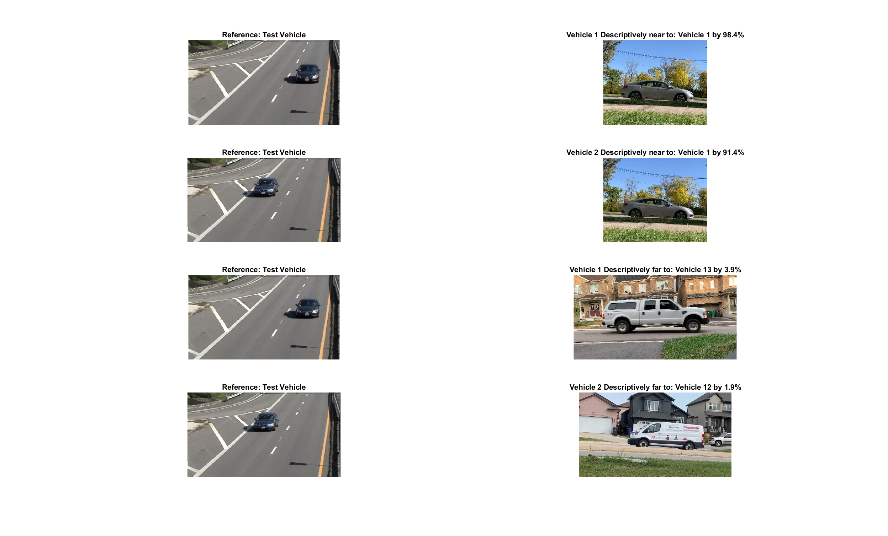
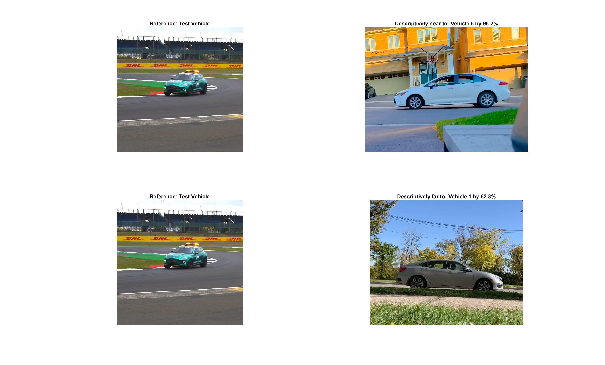

# Temporal Single & Multiple Moving Object Recognition

**One-shot, similarity-based recognition of single and multiple moving objects in complex video using temporal 4D shape descriptors and descriptive proximity.**

This repository presents my M.Sc. research in Computer Vision at the **Computational Intelligence Laboratory, University of Manitoba**.

The research investigates how **single and multiple moving objects** can be recognized from video using shape-based temporal representations rather than requiring large labeled image datasets. The proposed approach estimates **four-dimensional (4D) shape descriptors** for moving objects and compares those descriptors using **descriptive proximity** to determine how descriptively near or far test objects are from available training objects.

Unlike a conventional classifier that outputs class probabilities, this approach performs **descriptor-based similarity comparison** between test and training objects.

[View M.Sc. Thesis](https://mspace.lib.umanitoba.ca/items/a267fb22-720b-4493-96c1-e15bc2aefd8a) · [Methodology](docs/methodology.md) · [Experimental Results](docs/results.md)

---

## Research Problem

Recognizing moving objects in real-world video is challenging because object appearance can change due to:

- viewpoint
- movement
- scale
- background complexity
- partial visual variation across frames
- the presence of multiple moving objects within the same scene

Many conventional recognition approaches depend on large labeled datasets containing multiple examples of each class.

This research explores a different approach: **recognizing single and multiple moving objects when only one training video is available for each object class**.

Instead of learning a direct mapping from an object to class probabilities, the approach characterizes each moving object through temporal geometric properties and compares its descriptor representation with those of the available training objects.

The **one-shot setting** therefore refers to using **one training video per object class**, while the recognition framework is evaluated on both individual moving objects and scenes containing multiple moving objects.

---

## Similarity-Based Recognition

The research was conceptually motivated by similarity-based approaches such as those used in **Siamese Neural Networks**, where the objective is to compare representations rather than rely only on conventional multiclass classification.

The proposed thesis methodology itself is **not a Siamese neural network**.

Instead, it applies the similarity concept using a non-neural, shape-based computer vision framework:

```text
Moving Test Object
        ↓
Temporal Shape Analysis
        ↓
4D Shape Descriptor
        ↓
Compare with Training Descriptor Sets
        ↓
Descriptive Proximity
        ↓
Descriptively Near / Far Objects
```

Recognition is therefore based on the **descriptive relationship between object representations**, rather than conventional output class probabilities.

---

## Proposed Approach

The method extends shape-based object representation into the **temporal domain**.

At a high level, the recognition pipeline is:

```text
Input Video
    ↓
Moving Object Detection / Extraction
    ↓
Single or Multiple Object Representation
    ↓
Cell Complex Construction
    ↓
Temporal Shape Analysis
    ↓
4D Shape Descriptor Estimation
    ↓
Descriptor Comparison
    ↓
Descriptive Proximity Analysis
    ↓
Nearest / Farthest Training Object
    ↓
Similarity-Based Object Recognition
```

For each detected moving object, the system constructs a **four-dimensional temporal shape representation**.

The descriptor contains four characteristics:

| Dimension | Descriptor |
|---|---|
| 1 | Number of Boundary Points |
| 2 | Area of the Foreground Shape |
| 3 | Barycenter Nerve Vortex Area |
| 4 | Fermi Energy of the Shape |

Conceptually:

\[
S = [B, A, V, F]
\]

The resulting descriptor sets are compared to determine their **descriptive proximity** — how closely the geometric and temporal characteristics of an observed object correspond to those of objects represented in the training dataset.

When multiple objects are present within the same scene, descriptors are estimated and evaluated independently for each detected object.

[View Detailed Methodology](docs/methodology.md)

---

## Key Contributions

- Extended moving-object shape representation into the **temporal domain**
- Developed a **4D shape-descriptor representation** for moving objects across video
- Addressed both **single and multiple moving-object recognition**
- Investigated recognition using **one training video per object class**
- Applied **descriptive proximity** for descriptor-based similarity comparison
- Used geometric and topological cell-complex structures for object representation
- Evaluated recognition under changes in object viewpoint and environmental conditions
- Extended the recognition framework to multiple moving objects within the same video scene
- Applied the methodology to vehicle recognition in complex outdoor environments

---

## Test Scenarios

### Multiple Moving Object Recognition

This test evaluates a scene containing **multiple moving objects within the same video sequence**.

The algorithm detects individual moving objects, constructs their cell-complex representations, estimates their temporal 4D shape descriptors, and compares each representation against the available training-object descriptors.

[View Demo](assets/demos/vehicle-test31-detection.mp4)



For Test Video 31, two independently detected moving vehicles produced nearest descriptive-proximity scores of:

| Detected Object | Nearest Training Vehicle | Descriptive Proximity |
|---|---:|---:|
| Object 1 | Vehicle 1 | 98.4% |
| Object 2 | Vehicle 1 | 91.4% |

The descriptor-comparison process can therefore be applied separately to multiple foreground objects occurring within the same scene.

---

### Single Object Recognition from a Different Viewpoint

This test evaluates recognition of a **single moving object observed from a viewpoint different from the available training observation**.

[View Demo](assets/demos/vehicle-test36-detection.mp4)



After estimating the detected object's temporal shape descriptor and applying descriptive proximity, the approach identifies the training object with the closest descriptive characteristics.

This experiment evaluates whether the representation retains useful similarity information despite changes in object viewpoint and orientation.

---

## Experimental Results

The recognition methodology was evaluated on both individual moving objects and scenes containing multiple moving vehicles.

- **18 training vehicle classes**, with one training video per class
- **Single-object tests:** nearest descriptive-proximity scores ranged from **81.1% to 99.7%**
- **Multiple-object tests:** eight detected objects across four multi-object videos produced nearest descriptive-proximity scores from **90.8% to 99.9%**
- **Broader test results:** **28 of 33 reported results** produced nearest descriptive-proximity scores above **90%**
- **19 of 33 reported results** were within the **96–100% descriptive-proximity range**

> **Important:** Descriptive proximity is a descriptor-based similarity measure. These percentages should not be interpreted as conventional classification accuracy, precision, recall, or F1 scores.

[View Detailed Experimental Results](docs/results.md)

---

## Research Characteristics

| Area | Approach |
|---|---|
| Domain | Computer Vision / Pattern Recognition |
| Input | Video |
| Problem | Single & Multiple Moving Object Recognition |
| Recognition Paradigm | Similarity-Based / Descriptor Matching |
| Learning Setting | One-Shot Recognition |
| Training Data | One Video per Object Class |
| Training Classes | 18 Vehicle Classes |
| Representation | Temporal 4D Shape Descriptors |
| Matching | Euclidean Descriptor Comparison |
| Similarity Framework | Descriptive Proximity |
| Implementation | MATLAB |
| Application | Moving Vehicle Recognition |

---

## Why This Work Is Different

The objective of this research was not to build another large-data image classifier.

Instead, it investigates whether **single and multiple moving objects can be recognized from limited training data by comparing their geometric and temporal representations**.

This makes the work particularly relevant to scenarios where:

- labeled training data is scarce
- only one or a small number of reference samples are available
- similarity between objects is more important than conventional class-probability output
- temporal information provides useful characteristics beyond a single image
- multiple moving objects must be evaluated independently within the same scene
- recognition should remain interpretable through measurable geometric properties

The methodology combines:

**foreground detection → computational geometry → cell-complex construction → temporal feature extraction → 4D descriptors → similarity comparison → descriptive proximity**

rather than relying solely on learned pixel-level representations.

---

## Technical Documentation

For readers interested in the algorithmic details:

### [Methodology](docs/methodology.md)

Includes:

- dataset and experimental setup
- Gaussian Mixture Model foreground detection
- triangulation
- Maximal Nucleus Cluster
- Barycenter Vortex Cycle
- convex hull construction
- four-dimensional shape descriptors
- frame filtering
- training descriptor generation
- Euclidean descriptor comparison
- descriptive proximity
- single-object recognition
- multiple-object recognition
- algorithm pseudocode
- descriptive-proximity checkerboard

### [Experimental Results](docs/results.md)

Includes:

- single-object descriptive-proximity results
- multiple-object descriptive-proximity results
- viewpoint variation experiments
- descriptive-proximity distribution
- multiple-object checkerboard visualization
- interpretation of experimental results

---

## Implementation Availability

The original research implementation was developed in **MATLAB** as part of the M.Sc. thesis work.

The MATLAB source code is **not included in this public repository**.

Instead, this repository provides the publicly disclosed research methodology through:

- algorithm descriptions and pseudocode
- methodology documentation
- test videos
- quantitative experimental results
- recognition-result visualizations
- descriptive-proximity analysis

The complete mathematical formulation, theoretical background, and research discussion are available in the published thesis.

---

## Repository Structure

```text
.
├── assets/
│   ├── demos/            # Video outputs from test scenarios
│   └── results/          # Recognition-result visualizations
│
├── docs/
│   ├── methodology.md    # Algorithm and technical methodology
│   └── results.md        # Experimental evaluation and results
│
└── README.md
```

---

## Thesis

**Temporal Multiple Moving Objects Recognition Using Shape-Based Descriptor Matching**

**Juwairiah Zia**  
M.Sc. Electrical and Computer Engineering  
University of Manitoba, 2023

[Read the Full Thesis](https://mspace.lib.umanitoba.ca/items/a267fb22-720b-4493-96c1-e15bc2aefd8a)

---

## Research Areas

`Computer Vision` · `Video Analysis` · `Single Object Recognition` · `Multiple Object Recognition` · `Similarity-Based Recognition` · `One-Shot Recognition` · `Temporal Analysis` · `4D Shape Descriptors` · `Computational Geometry` · `Pattern Recognition` · `Descriptive Proximity` · `MATLAB`
