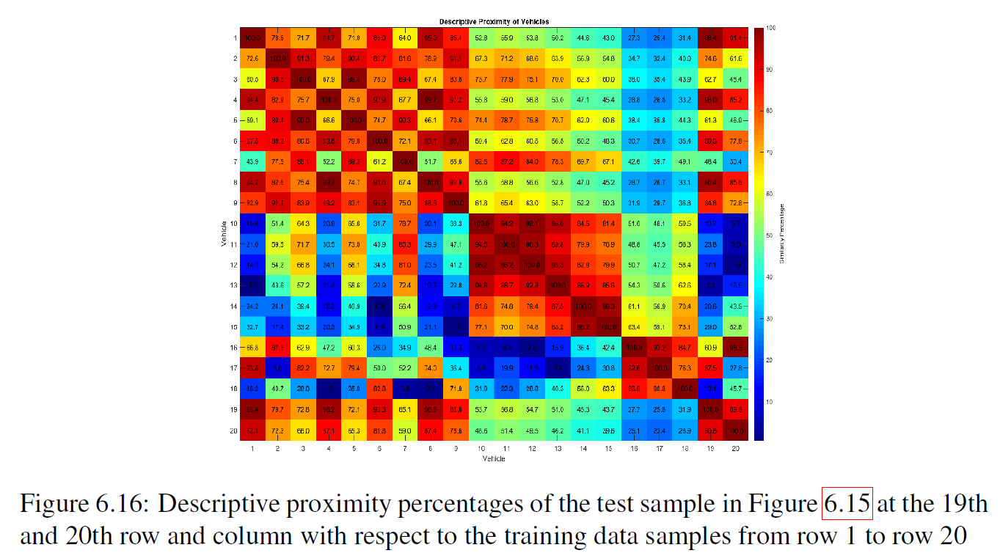

# Methodology

## Overview

This research proposes a shape-based approach for recognizing **single and multiple moving objects in video** using temporal information and a four-dimensional (4D) shape representation.

The methodology consists of two main stages:

1. **Training descriptor generation** — construct cell complexes and estimate a shape-descriptor set for each training object.
2. **Object recognition** — construct descriptors for objects detected in a test video and compare them with the training descriptor sets using **descriptive proximity**.

The approach was developed for a **one-shot recognition setting**, where each object class is represented by one training video rather than requiring a large labeled image dataset.

**Quick navigation:** [Dataset](#1-dataset) · [4D Descriptor](#4-four-dimensional-shape-descriptor) · [Training Algorithm](#7-algorithm-1--training-shape-descriptor-estimation) · [Descriptive Proximity](#10-descriptive-proximity) · [Multiple Object Recognition](#12-multiple-object-recognition) · [Experimental Results](results.md)

---

## System Pipeline

```text
Training Videos
      ↓
Foreground Detection
      ↓
Seed Point & Centroid Extraction
      ↓
Triangulation
      ↓
Cell Complex Construction
      ├── Maximal Nucleus Cluster (MNC)
      ├── Barycenter Vortex Cycle
      └── Convex Hull
      ↓
Geometric / Topological Measurements
      ↓
Frame Filtering
      ↓
4D Shape Descriptor Set
      ↓
Training Descriptor Database
                    │
                    │
Test Video          │
      ↓             │
Moving Object Detection
      ↓             │
Object-wise Descriptor Estimation
      ↓             │
Euclidean Comparison
      └─────────────┘
      ↓
Descriptive Proximity Normalization
      ↓
Nearest / Farthest Descriptor Analysis
      ↓
Single or Multiple Object Recognition
```

---

## 1. Dataset

Moving vehicles were used as the real-world application for evaluating the recognition approach.

The video dataset was recorded in outdoor urban environments using a stationary digital camera supported by a stabilizer to reduce unwanted camera motion and shakiness.

### Training Dataset

The training dataset contains:

| Property | Value |
|---|---|
| Training objects | 18 vehicles |
| Number of classes | 18 |
| Samples per class | 1 video |
| Frames per video | 120 |
| Frame rate | 30 FPS |
| Object types | Cars, vans, trucks, and buses |
| Environment | Outdoor urban scenes |

Each vehicle is treated as an **individual object class**.

Therefore, the recognition problem is formulated as a one-shot setting in which only **one training video is available for each object class**.

Rather than learning from many labeled examples of the same object, the algorithm extracts a representative shape-descriptor set from each training video.

---

### Test Dataset

The test dataset was designed to evaluate recognition under varied real-world conditions, including:

- different vehicle types
- different recording locations
- changes in luminance
- different object viewpoints
- different object orientations
- individual moving objects
- multiple moving objects within the same scene

This allows the recognition approach to be evaluated beyond the specific conditions observed in the training videos.

---

## 2. Foreground Detection

The first stage detects moving foreground objects within each video frame.

A **Gaussian Mixture Model (GMM)** and morphological operations are applied to separate moving foreground regions from the background.

For each detected foreground shape, the algorithm identifies:

- foreground boundary and shape
- seed points
- number of detected objects
- centroid associated with each object

The number of detected centroids provides an indication of how many moving objects are present within the frame.

Each detected object is then processed independently.

---

## 3. Cell Complex Construction

For each detected foreground object, a geometric cell complex is constructed.

The process consists of several stages.

### 3.1 Triangulation

Seed points extracted from the foreground shape are used to construct a **triangulation mesh** across the object.

The triangulated representation provides the geometric foundation from which subsequent cell-complex structures are estimated.

```text
Foreground Shape
      ↓
Seed Points
      ↓
Triangulation Mesh
```

---

### 3.2 Maximal Nucleus Cluster (MNC)

The triangulated object is analyzed to determine its **Maximal Nucleus Cluster (MNC) nerve**.

The associated nerve area is then estimated.

The MNC contributes structural information describing the organization of the object's triangulated representation.

---

### 3.3 Barycenter Vortex Cycle

A **Barycenter Vortex Cycle** is constructed over the Maximal Nucleus Cluster.

Its associated area is estimated and contributes to the geometric characterization of the moving foreground object.

---

### 3.4 Convex Hull

The barycenters of the outermost triangles satisfying the convex-hull condition are identified.

These points are used to construct a **convex hull** surrounding the object and estimate its area.

---

### 3.5 Additional Shape Measurements

Additional measurements are calculated from the resulting cell-complex representation, including:

- geometric area relationships
- differences between foreground and internal cell-complex areas
- Fermi energy associated with the foreground shape

These measurements contribute to the final shape representation used by the recognition algorithm.

---

## 4. Four-Dimensional Shape Descriptor

Each detected moving object is represented using a **four-dimensional (4D) shape descriptor** derived from its geometric and cell-complex characteristics.

The descriptor-generation workflow can be summarized as:

```text
Foreground Object
      ↓
Cell Complex Construction
      ↓
┌─────────────────────────────────┐
│ 4D Shape Descriptor             │
│                                 │
│ 1. Boundary Points              │
│ 2. Shape Area                   │
│ 3. Barycenter Vortex Area       │
│ 4. Fermi Energy                 │
└─────────────────────────────────┘
      ↓
Temporal Aggregation
      ↓
Descriptor Set
      ↓
Euclidean Comparison
      ↓
Descriptive Proximity
```

The descriptor contains four measurements:

| Dimension | Descriptor |
|---|---|
| 1 | Number of Boundary Points |
| 2 | Area of the Foreground Shape |
| 3 | Barycenter Nerve Vortex Area |
| 4 | Fermi Energy of the Shape |

Conceptually, the descriptor can be represented as:

\[
S = [B, A, V, F]
\]

where:

- \(B\) = number of boundary points
- \(A\) = foreground shape area
- \(V\) = Barycenter Nerve Vortex area
- \(F\) = Fermi energy of the foreground shape

Descriptor components are estimated across the video frames in which an object is observed.

Frames containing incomplete object observations are subsequently filtered, and the valid temporal measurements are aggregated to construct a representative **shape-descriptor set for each moving object**.

### Example Training Descriptors

The following are selected examples from the 18 training vehicle classes reported in the thesis:

| Training Video ID | Moving Object | Boundary Points | Shape Area | Barycenter Nerve Vortex Area | Fermi Energy |
|---:|---|---:|---:|---:|---:|
| 1 | Car | 1,436 | 91,368 | 8,234 | 6,622 × 10⁻⁶ |
| 7 | Car | 1,786 | 142,885 | 21,480 | 2,311 × 10⁻⁶ |
| 9 | Car | 1,466 | 107,071 | 21,327 | 757 × 10⁻⁶ |
| 11 | Pickup Truck | 1,140 | 164,292 | 23,523 | 4,513 × 10⁻⁶ |
| 13 | Cargo Van | 1,367 | 182,827 | 27,636 | 797 × 10⁻⁶ |
| 14 | Commercial Equipment Van | 1,902 | 205,463 | 43,068 | 524 × 10⁻⁶ |
| 15 | Delivery Truck | 3,896 | 212,370 | 42,907 | 3,560 × 10⁻⁶ |
| 16 | Public Bus | 3,522 | 336,017 | 27,257 | 12,435 × 10⁻⁶ |
| 18 | Public Bus | 3,365 | 291,350 | 20,198 | 6,036 × 10⁻⁶ |

These examples illustrate how moving objects with different geometric characteristics produce different descriptor representations.

The descriptor values are subsequently compared with test-object descriptors as part of the **descriptive-proximity calculation**.

> The complete mathematical formulation and derivation of the four-dimensional descriptor are provided in the M.Sc. thesis.

---

## 5. Frame Filtering

Not every detected video frame provides a valid representation of an object.

For example, an object may be:

- entering the frame
- leaving the frame
- partially visible
- incompletely segmented

A **frame-filtering step** removes shape descriptors corresponding to frames where the object is not fully visible.

This helps prevent incomplete object observations from affecting the final temporal descriptor representation.

---

## 6. Shape Descriptor Set

After frame filtering, valid descriptors associated with an object are aggregated.

For each descriptor dimension, the algorithm calculates a representative value across the accepted frames.

Where required by the methodology, descriptor values are scaled before being stored.

The resulting **shape-descriptor set** represents the training object and is retained for comparison during recognition.

---

## 7. Algorithm 1 — Training Shape Descriptor Estimation

The following pseudocode summarizes the first algorithm described in the thesis.

```text
Algorithm 1: Cell Complex Construction and
             Shape Descriptor Estimation

Input:
    Training video

Output:
    Shape descriptor set for the training object

1. Detect moving foreground shapes using:
       - Gaussian Mixture Model
       - Morphological operations

2. For each video frame:
       a. Identify seed points belonging to foreground shapes.
       b. Determine the number of detected shapes.
       c. Estimate the centroid of each shape.

3. While one or more centroids are present:

       For each detected foreground shape:

           a. Triangulation
              Construct a triangulation mesh
              using foreground seed points.

           b. Maximal Nucleus Cluster
              Identify the Maximal Nucleus Cluster
              (MNC) nerve.
              Estimate its associated area.

           c. Barycenter Vortex Cycle
              Construct the Barycenter Vortex Cycle
              over the MNC.
              Estimate its associated area.

           d. Convex Hull
              Identify barycenters of the outermost
              triangles satisfying the convex-hull
              condition.
              Construct the convex hull and estimate
              its area.

           e. Cell Complex Representation
              Generate or visualize:
                  - seed points
                  - triangulation mesh
                  - convex hull
                  - nerve/cycle structures

           f. Calculate additional geometric
              shape measurements.

           g. Calculate foreground Fermi energy.

4. Apply frame filtering:
       Remove descriptors obtained when an object
       is not fully visible.

5. Construct the Shape Descriptor Set:
       - calculate representative descriptor values
       - apply scaling where required
       - save the descriptor set for recognition

6. Store the resulting training descriptor set.
```

---

## 8. Object Recognition

During testing, the same cell-complex and descriptor-estimation process is applied to each detected moving object.

A test object's descriptor set is then compared with every descriptor set stored from the training dataset.

---

## 9. Euclidean Descriptor Comparison

For a test descriptor set \(S_t\) and a training descriptor set \(S_i\), a Euclidean measure is used to quantify their difference.

Conceptually:

\[
d_i = \left\|S_t - S_i\right\|_2
\]

where:

- \(S_t\) represents the test object's descriptor set
- \(S_i\) represents a training object's descriptor set
- \(d_i\) represents the Euclidean difference between them

The comparison is performed between the detected test object and **each of the available training object classes**.

---

## 10. Descriptive Proximity

The Euclidean comparison values are normalized into a **0–100% descriptive-proximity representation**.

Descriptive proximity expresses how closely the characteristics of a detected test object correspond to those of a training object.

Conceptually:

```text
Higher Descriptive Proximity
        ↓
More Descriptively Near
        ↓
Greater Shape Similarity
```

while:

```text
Lower Descriptive Proximity
        ↓
More Descriptively Far
        ↓
Greater Shape Dissimilarity
```

The normalized values are visualized in the research using a **descriptive-proximity checkerboard**.

> Descriptive proximity is a descriptor-based similarity measure and should not be interpreted as conventional classification accuracy.

---

### Descriptive Nearness

The descriptive-proximity values are analyzed to identify the training sample most similar to the detected test object.

The training sample whose descriptive-proximity value is **closest to 100%** is considered descriptively nearest.

```text
arg max (Descriptive Proximity)
        ↓
Most Descriptively Near Training Object
```

---

### Descriptive Farness

The training sample whose descriptive-proximity value is **closest to 0%** is considered descriptively farthest.

```text
arg min (Descriptive Proximity)
        ↓
Most Descriptively Far Training Object
```

These measurements allow both similarity and dissimilarity between detected objects and training examples to be examined.

---

## 11. Single Object Recognition

For single-object recognition, one moving object is detected and its descriptor set is compared against the 18 training classes.

The workflow is:

```text
Single Moving Object
        ↓
Foreground Extraction
        ↓
Cell Complex Construction
        ↓
Temporal 4D Descriptor
        ↓
Compare Against
18 Training Descriptors
        ↓
Descriptive Proximity
        ↓
Nearest Training Object
        ↓
Recognition Result
```

The experiments included changes in viewpoint, allowing test vehicles to be observed from orientations different from those represented by their training observations.

---

## 12. Multiple Object Recognition

The same recognition framework is extended to scenes containing multiple moving objects.

Each detected centroid represents an individual foreground object to be processed.

For each object, the algorithm:

1. constructs its cell complex
2. estimates its shape-descriptor set
3. compares it with the training descriptor database
4. calculates descriptive-proximity values
5. determines its nearest and farthest training samples

Each moving object can therefore be evaluated **independently within the same video sequence**.

---

## 13. Algorithm 2 — Multiple Object Recognition

The following pseudocode summarizes the multiple-object recognition algorithm presented in the thesis.

```text
Algorithm 2: Multiple Object Recognition
             Using Cell Complexes

Input:
    Test video
    Training shape-descriptor sets

Output:
    Descriptive proximity and recognition
    results for each detected moving object

1. Apply the foreground-detection stage
   from Algorithm 1.

2. For each frame:
       a. Generate foreground seed points.
       b. Determine the number of object centroids.

3. While one or more centroids are detected:

       For each detected object:

           a. Apply triangulation.

           b. Construct the Maximal Nucleus Cluster.

           c. Construct the Barycenter Vortex Cycle.

           d. Construct the convex hull.

           e. Generate the cellular-complex
              representation.

           f. Apply frame filtering.

           g. Estimate the object's
              shape-descriptor set.

4. Compare the test object's descriptor set with
   every training descriptor set using
   Euclidean distance.

5. Normalize the Euclidean measures into
   descriptive-proximity percentages
   from 0–100%.

6. Represent the descriptive proximities using
   the checkerboard visualization.

7. Determine Descriptive Nearness:
       Select the training object whose
       descriptive proximity is closest to 100%.

8. Determine Descriptive Farness:
       Select the training object whose
       descriptive proximity is closest to 0%.

9. Associate the detected object with its
   descriptively nearest training sample.

10. Repeat the descriptive-proximity analysis
    independently for each additional object
    detected in the scene.
```

---

## 14. Multiple-Object Checkerboard Extension

During training, descriptive-proximity relationships among the **18 training vehicle classes** are represented using an **18 × 18 checkerboard**.

When new test objects are detected, the checkerboard is dynamically extended by adding one row and one column for each detected object.

For example, Test Video 31 contains two detected moving vehicles:

```text
Training Objects = 18

Test Object 1 → Row / Column 19
Test Object 2 → Row / Column 20

Extended Descriptive-Proximity Matrix = 20 × 20
```

The first 18 rows and columns represent the training vehicle classes.

The additional rows and columns represent the detected test objects and contain their descriptive-proximity relationships with the training samples.

### Example: Two-Object Checkerboard



*For a two-object test sequence, the original 18 × 18 training matrix is extended to 20 × 20. Rows and columns 19 and 20 represent the two detected moving test objects.*

This representation makes it possible to inspect the descriptor-based similarity relationships of multiple detected objects against the training dataset within the same experiment.

Detailed values and experimental interpretation are available in the [Experimental Results](results.md).

---

## 15. Experimental Evaluation

The methodology was evaluated on both **single-object and multiple-object video sequences**, including changes in:

- viewpoint
- vehicle type
- recording location
- luminance
- object orientation

The experiments compare test-object shape descriptors against the 18 training-object descriptor sets using descriptive proximity.

Detailed quantitative results, including single-object tests, multiple-object tests, and the descriptive-proximity distribution, are available in:

[View Experimental Results](results.md)

---

## 16. Research Characteristics

The methodology differs from conventional large-data object classifiers in several ways.

### Limited Training Data

Each vehicle class is represented by **one training video**, enabling recognition to be investigated in a one-shot setting.

### Temporal Shape Information

Object characteristics are extracted across video frames rather than relying exclusively on a single static image.

### Geometric and Topological Representation

Recognition is based on cell-complex structures and shape descriptors rather than relying exclusively on learned pixel representations.

### Object-Wise Multiple Recognition

Multiple foreground objects can be detected and analyzed independently within the same video sequence.

### Interpretable Similarity

The descriptive-proximity representation provides an explicit numerical indication of the descriptive nearness and farness between test and training objects.

---

## 17. Implementation Availability

The original research implementation was developed in **MATLAB** as part of the M.Sc. thesis work.

The MATLAB source code is **not included in this public repository**.

This repository instead provides:

- the published research methodology
- algorithm descriptions and pseudocode
- experimental setup
- test videos
- result visualizations
- descriptive-proximity results

The technical methodology documented here is based on material disclosed in the publicly available M.Sc. thesis.

For the complete mathematical formulation, theoretical background, and experimental analysis, refer to the full thesis.

---

## Reference

**Temporal Multiple Moving Objects Recognition Using Shape-Based Descriptor Matching**  
**Juwairiah Zia**  
M.Sc. Electrical and Computer Engineering  
University of Manitoba, 2023

[View the full thesis](https://mspace.lib.umanitoba.ca/items/a267fb22-720b-4493-96c1-e15bc2aefd8a)
